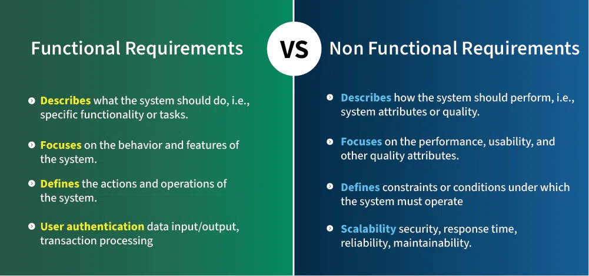

# نیازمندی‌های عملکردی در برابر غیرعملکردی

## بخش ترجمه‌شده

### تعریف و مقدمه
- **نیازمندی‌های عملکردی در برابر غیرعملکردی**  
  نیازمندی‌های عملکردی در مقابل غیرعملکردی  
- **تحلیل نیازمندی‌ها فرآیندی ضروری است که موفقیت یک پروژه سیستم یا نرم‌افزار را ارزیابی می‌کند.**  
  بررسی نیازمندی‌ها گامی کلیدی است که میزان موفقیت یک پروژه سیستمی یا نرم‌افزاری را مشخص می‌کند.  
- **نیازمندی‌ها معمولاً به دو نوع تقسیم می‌شوند: نیازمندی‌های عملکردی و غیرعملکردی.**  
  خواسته‌ها به‌طور کلی به دو دسته تقسیم می‌شوند: عملکردی و غیرعملکردی.  
- **نیازمندی‌های عملکردی رفتار یا عملکردهای خاص سیستم را تعریف می‌کنند.**  
  نیازمندی‌های عملکردی کارها و رفتارهای مشخص سیستم را تعیین می‌کنند.  
- **در مقابل، نیازمندی‌های غیرعملکردی چگونگی انجام وظایف سیستم را مشخص می‌کنند و بر ویژگی‌هایی مانند عملکرد، امنیت، مقیاس‌پذیری و کاربری تمرکز دارند.**  
  اما نیازمندی‌های غیرعملکردی نحوه انجام این کارها را توضیح می‌دهند و بر جنبه‌هایی مثل کارایی، امنیت، گسترش‌پذیری و راحتی استفاده تمرکز دارند.  



### فهرست مطالب
- **فهرست موضوعات**  
  - نیازمندی‌های عملکردی چیست؟  
  - نیازمندی‌های غیرعملکردی چیست؟  
  - نیازمندی‌های اضافی چیست؟  
  - مثال‌هایی از نیازمندی‌های عملکردی و غیرعملکردی  
  - تفاوت‌های بین نیازمندی‌های عملکردی و غیرعملکردی  
  - اهمیت تعادل بین این دو نوع نیازمندی  
  - چالش‌های رایج در تعریف این نیازمندی‌ها  
  - چگونه نیازمندی‌های عملکردی و غیرعملکردی را جمع‌آوری کنیم؟  

### نیازمندی‌های عملکردی
- **نیازمندی‌های عملکردی چیست؟**  
  نیازمندی‌های عملکردی چه هستند؟  
- **این‌ها نیازمندی‌هایی هستند که کاربر نهایی به‌طور خاص به‌عنوان امکانات اولیه سیستم درخواست می‌کند.**  
  این‌ها خواسته‌هایی هستند که کاربر به‌عنوان نیازهای اصلی و پایه‌ای سیستم مطرح می‌کند.  
- **تمام این عملکردها باید به‌عنوان بخشی از قرارداد در سیستم گنجانده شوند.**  
  همه این قابلیت‌ها باید طبق توافق در سیستم پیاده شوند.  
- **این‌ها به‌صورت ورودی‌هایی که به سیستم داده می‌شود، عملیاتی که انجام می‌شود و خروجی‌های مورد انتظار بیان می‌شوند.**  
  این‌ها با ورودی‌هایی که به سیستم می‌دهیم، کارهایی که انجام می‌دهد و نتایجی که انتظار داریم تعریف می‌شوند.  
- **این‌ها نیازمندی‌هایی هستند که کاربر بیان می‌کند و در محصول نهایی مستقیماً قابل‌مشاهده‌اند، برخلاف نیازمندی‌های غیرعملکردی.**  
  این‌ها نیازهایی هستند که کاربر می‌گوید و در محصول نهایی به‌چشم می‌آیند، نه مثل غیرعملکردی‌ها.  
- **مثال‌ها:**  
  - چه قابلیت‌هایی باید برای این سیستم طراحی کنیم؟  
  - آیا شرایط خاصی (لبه‌ای) هست که باید در طراحی مدنظر قرار دهیم؟  

### نیازمندی‌های غیرعملکردی
- **نیازمندی‌های غیرعملکردی چیست؟**  
  نیازمندی‌های غیرعملکردی کدام‌اند؟  
- **این‌ها محدودیت‌های کیفی هستند که سیستم باید طبق قرارداد پروژه برآورده کند.**  
  این‌ها شرایط کیفی هستند که سیستم باید بر اساس توافق پروژه به آن‌ها پایبند باشد.  
- **اولویت یا میزان پیاده‌سازی این عوامل از پروژه‌ای به پروژه دیگر متفاوت است.**  
  اهمیت یا سطح اجرای این موارد از پروژه‌ای به پروژه دیگر فرق دارد.  
- **به این‌ها نیازمندی‌های غیررفتاری نیز گفته می‌شود.**  
  گاهی به این‌ها نیازمندی‌های غیررفتاری هم می‌گویند.  
- **این‌ها به مسائلی مانند موارد زیر مربوط می‌شوند:**  
  - قابلیت انتقال  
  - امنیت  
  - نگهداری  
  - اطمینان  
  - مقیاس‌پذیری  
  - کارایی  
  - استفاده مجدد  
  - انعطاف‌پذیری  
- **مثال‌ها:**  
  - هر درخواست باید با کمترین تأخیر پردازش شود؟  
  - سیستم باید بسیار قابل‌اعتماد باشد.  

### نیازمندی‌های اضافی
- **نیازمندی‌های اضافی چیست؟**  
  نیازمندی‌های اضافی چه هستند؟  
- **این‌ها اساساً نیازمندی‌هایی هستند که "خوب است داشته باشیم" و ممکن است خارج از محدوده سیستم باشند.**  
  این‌ها خواسته‌هایی هستند که داشتنشان خوب است اما شاید جزو محدوده اصلی سیستم نباشند.  
- **مثال:**  
  - سیستم ما باید معیارها و تحلیل‌ها را ثبت کند.  
  - نظارت بر سلامت و کارایی سرویس.  

### مثال‌های نیازمندی‌ها
- **مثال‌هایی از نیازمندی‌های عملکردی و غیرعملکردی**  
  - **۱. سیستم بانکداری آنلاین**  
    - **نیازمندی‌های عملکردی:**  
      - کاربران باید بتوانند با نام کاربری و رمز عبور وارد شوند.  
      - کاربران باید بتوانند موجودی حسابشان را ببینند.  
      - کاربران باید پس از تراکنش اعلان دریافت کنند.  
    - **نیازمندی‌های غیرعملکردی:**  
      - سیستم باید در کمتر از ۲ ثانیه به اقدامات کاربر پاسخ دهد.  
      - همه تراکنش‌ها باید رمزنگاری‌شده و با استانداردهای امنیتی صنعت سازگار باشند.  
      - سیستم باید بتواند ۱۰۰ میلیون کاربر را با کمترین قطعی مدیریت کند.  
  - **۲. اپلیکیشن تحویل غذا**  
    - **نیازمندی‌های عملکردی:**  
      - کاربران بتوانند منو را ببینند و سفارش بدهند.  
      - کاربران بتوانند پرداخت کنند و سفارششان را زنده پیگیری کنند.  
    - **نیازمندی‌های غیرعملکردی:**  
      - اپلیکیشن باید منوی رستوران را در کمتر از ۱ ثانیه بارگذاری کند.  
      - سیستم باید تا ۵۰,۰۰۰ سفارش همزمان در زمان شلوغی را پشتیبانی کند.  
      - اپلیکیشن باید برای کاربران جدید ساده و قابل‌فهم باشد.  

### تفاوت‌ها در جدول
- **تفاوت‌های بین نیازمندی‌های عملکردی و غیرعملکردی:**  
  | **جنبه**                | **نیازمندی‌های عملکردی**                              | **نیازمندی‌های غیرعملکردی**                          |  
  |--------------------------|-------------------------------------------------------|-------------------------------------------------------|  
  | **تعریف**               | می‌گوید سیستم چه باید بکند، مثل وظایف یا عملکردهای خاص. | می‌گوید سیستم چگونه باید کار کند، یعنی ویژگی‌ها و کیفیت آن. |  
  | **هدف**                 | بر رفتار و قابلیت‌های سیستم تمرکز دارد.                | بر کارایی، کاربری و سایر ویژگی‌های کیفی تمرکز دارد.   |  
  | **محدوده**              | کارها و عملیات سیستم را مشخص می‌کند.                  | شرایط و محدودیت‌هایی که سیستم باید در آن‌ها کار کند را تعیین می‌کند. |  
  | **مثال‌ها**             | احراز هویت کاربر، ورودی/خروجی داده، پردازش تراکنش.   | مقیاس‌پذیری، امنیت، زمان پاسخ، اطمینان، نگهداری.     |  
  | **اندازه‌گیری**         | به‌راحتی با خروجی‌ها یا نتایج قابل‌اندازه‌گیری است.      | اندازه‌گیری سخت‌تر است و اغلب با معیارها یا SLAها سنجیده می‌شود. |  
  | **تأثیر بر توسعه**       | طراحی اصلی و عملکرد سیستم را هدایت می‌کند.            | بر معماری و کارایی کلی سیستم اثر می‌گذارد.           |  
  | **تمرکز بر نیاز کاربر** | مستقیماً به خواسته‌های کاربر و کسب‌وکار مربوط است.     | بر تجربه کاربر و عملکرد سیستم تمرکز دارد.            |  
  | **مستندسازی**           | معمولاً در موارد استفاده یا مشخصات عملکردی ثبت می‌شود.  | از طریق معیارهای کارایی یا مشخصات فنی مستند می‌شود.   |  
  | **ارزیابی**             | با تست‌های عملکردی مثل تست واحد یا یکپارچه آزمایش می‌شود. | با تست‌های کارایی، امنیت و کاربری ارزیابی می‌شود.     |  
  | **وابستگی**             | مشخص می‌کند سیستم چه باید بکند تا نیازهای کاربر را برآورده کند. | به این بستگی دارد که سیستم چگونه وظایفش را انجام می‌دهد. |  

### اهمیت تعادل
- **اهمیت تعادل بین نیازمندی‌های عملکردی و غیرعملکردی**  
  - **بهبود تجربه کاربر:** سیستمی که فقط کار کند اما کند یا سخت باشد، کاربر را راضی نمی‌کند؛ ویژگی‌های غیرعملکردی مثل سرعت و کاربری تجربه را بهتر می‌کنند.  
  - **افزایش کارایی سیستم:** مقیاس‌پذیری و امنیت تضمین می‌کنند سیستم در دنیای واقعی خوب عمل کند.  
  - **جلوگیری از مشکلات:** بی‌توجهی به غیرعملکردی‌ها مثل امنیت می‌تواند خرابی یا قطعی بیاورد.  
  - **کاهش هزینه‌ها:** توجه به غیرعملکردی‌ها از ابتدا جلوی هزینه‌های بعدی را می‌گیرد.  
  - **پشتیبانی از توسعه:** قابلیت نگهداری و انعطاف‌پذیری به‌روزرسانی‌های آینده را آسان می‌کند.  

### چالش‌ها
- **چالش‌های رایج در تعریف این نیازمندی‌ها**  
  - ابهام: گاهی نیازها گنگ هستند و فهمیدنشان سخت است.  
  - تغییر: نیازها با پیشرفت پروژه عوض می‌شوند.  
  - اولویت‌بندی: انتخاب اینکه چه چیزی مهم‌تر است دشوار است.  
  - اندازه‌گیری: غیرعملکردی‌ها مثل کاربری سخت‌تر سنجیده می‌شوند.  
  - تداخل: مثلاً امنیت بالا ممکن است سرعت را کم کند.  

### روش جمع‌آوری
- **چگونه نیازمندی‌های عملکردی و غیرعملکردی را جمع‌آوری کنیم؟**  
  - **نیازمندی‌های عملکردی:**  
    - مصاحبه: با کاربران و ذینفعان برای فهم نیازها صحبت کنید.  
    - پرسشنامه: از گروه بزرگ‌تری نظر بگیرید.  
    - کارگاه: جلساتی برای ایده‌پردازی برگزار کنید.  
  - **نیازمندی‌های غیرعملکردی:**  
    - معیارهای کارایی: با تیم فنی برای تعیین استانداردها مشورت کنید.  
    - استانداردهای امنیتی: با کارشناسان امنیت برای حفاظت داده‌ها همکاری کنید.  
    - تست کاربری: سیستم را تست کنید تا نقاط ضعف رابط پیدا شود.  

## اطلاعات تکمیلی

### توضیحات پیشرفته و ساده
نیازمندی‌های عملکردی مثل دستور پخت غذا هستند (چه بکنیم)، و غیرعملکردی‌ها مثل کیفیت آشپزی (چطور بکنیم). اگر فقط مواد را آماده کنید اما خوب نپزید، غذا خوشمزه نمی‌شود. هر دو باید با هم باشند تا نتیجه عالی شود.

### مثال واقعی
- **اپلیکیشن تلگرام:**  
  - عملکردی: ارسال پیام و تماس.  
  - غیرعملکردی: سرعت بالا و امنیت قوی.  
- **شکست یک سیستم:** سیستمی که فقط پیام می‌فرستاد اما کند و ناامن بود، کنار گذاشته شد.  

### اصطلاحات کلیدی
- **SLA:** معیارهایی برای سنجش کیفیت مثل زمان پاسخ.  
- **موارد لبه‌ای:** شرایط خاص که سیستم باید مدیریت کند.  
- **انعطاف‌پذیری:** توانایی سیستم برای تطبیق با تغییرات.  

### یادداشت جانبی
```
نکته: در پروژه‌ها، گاهی ذینفعان فقط به عملکرد فکر می‌کنند؛ باید به آن‌ها نشان دهید که کیفیت (غیرعملکردی) هم حیاتی است!
```

## خلاصه
تحلیل نیازمندی‌ها موفقیت پروژه را با بررسی دو نوع نیاز تضمین می‌کند: عملکردی (چه کند) و غیرعملکردی (چطور کند). عملکردی‌ها رفتار سیستم را می‌سازند و غیرعملکردی‌ها کیفیت آن را بالا می‌برند. مثال‌ها مثل بانکداری آنلاین نشان می‌دهند هر دو باید باشند. جدول تفاوت‌ها نشان می‌دهد که این‌ها مکمل هم‌اند و تعادلشان تجربه کاربر، کارایی و پایداری را بهبود می‌دهد. چالش‌هایی مثل ابهام یا تغییر نیازها با روش‌هایی مثل مصاحبه و تست حل می‌شوند.

### تجسم
```
نمودار تعادل نیازمندی‌ها:
[عملکردی: ورود، سفارش] ----> [سیستم] <---- [غیرعملکردی: سرعت، امنیت]  
         |                             ↑  
         |______________تعادل______________|  
```
این نشان می‌دهد که سیستم مثل یک پل است که هر دو نوع نیاز را نگه می‌دارد.