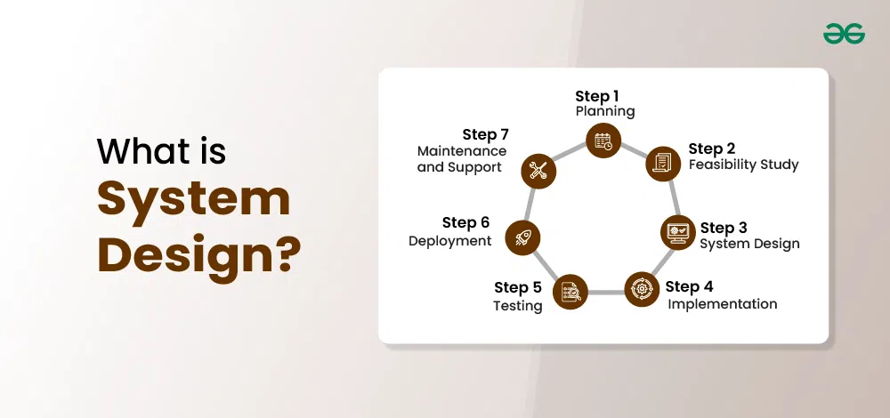
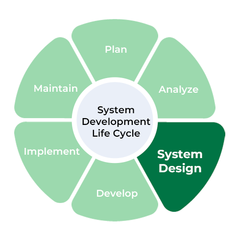
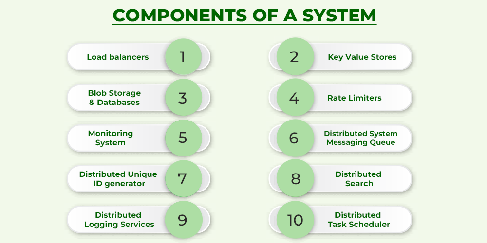

# طراحی سیستم‌ها چیست – آموزش طراحی سیستم‌ها

### تعریف و مقدمه
- **طراحی سیستم‌ها چیست – آموزش طراحی سیستم‌ها**  
 
- **طراحی سیستم‌ها فرآیند تعریف معماری، اجزا، ماژول‌ها، رابط‌ها و داده‌ها برای یک سیستم است تا نیازهای مشخص‌شده را برآورده کند.**  
  طراحی سیستم‌ها یعنی برنامه‌ریزی ساختار کلی (معماری)، قطعات کوچک (اجزا)، بخش‌های مستقل (ماژول‌ها)، نقاط اتصال (رابط‌ها) و اطلاعات (داده‌ها) برای ساخت سیستمی که به خواسته‌های تعیین‌شده پاسخ دهد.  
- **این شامل ترجمه نیازهای کاربر به یک طرح جامع است که فاز پیاده‌سازی را هدایت می‌کند.**  
  در این کار، نیازهای کاربران به یک نقشه دقیق تبدیل می‌شود که راهنمای ساخت سیستم است.  
- **هدف، ایجاد یک ساختار منظم و کارآمد است که هدف موردنظر را برآورده کند، در حالی که عواملی مانند مقیاس‌پذیری، قابلیت نگهداری و عملکرد را در نظر می‌گیرد.**  
  هدف، ساخت سیستمی منظم و مؤثر است که هم کار موردنظر را انجام دهد و هم ویژگی‌هایی مثل گسترش‌پذیری، نگهداری آسان و کارایی بالا داشته باشد.  

### فهرست مطالب
- **طراحی سیستم چیست**  
  مفهوم طراحی سیستم  
- **فهرست موضوعات**  
  - چرا طراحی سیستم را یاد بگیریم؟  
  - اهداف طراحی سیستم‌ها  
  - مزایای طراحی سیستم  
  - اجزای طراحی سیستم  
  - چرخه حیات طراحی سیستم (SDLC)  
  - معماری سیستم  
  - مدولاریتی و رابط‌ها در طراحی سیستم‌ها  
  - تکامل، ارتقا و مقیاس‌بندی سیستم موجود  
  - جریان داده‌ها در سیستم چگونه است؟  
  - مثال طراحی سیستم: سیستم رزرواسیون خطوط هوایی  

### اهمیت یادگیری طراحی سیستم‌ها
- **چرا طراحی سیستم را یاد بگیریم؟**  
  چه لزومی به یادگیری طراحی سیستم داریم؟  
- **در هر فرآیند توسعه، چه نرم‌افزار باشد چه فناوری دیگر، مهم‌ترین مرحله طراحی است.**  
  در هر پروژه توسعه، چه نرم‌افزاری باشد چه در حوزه فناوری، طراحی کلیدی‌ترین بخش است.  
- **بدون فاز طراحی، نمی‌توانید به فاز پیاده‌سازی یا آزمایش بروید.**  
  اگر طراحی را انجام ندهید، نمی‌توانید سیستم را بسازید یا آزمایش کنید.  
- **همین موضوع در مورد سیستم نیز صدق می‌کند.**  
  این قانون برای سیستم‌ها هم برقرار است.  
- **طراحی سیستم‌ها نه تنها یک گام حیاتی در توسعه سیستم است، بلکه ستون فقرات مدیریت سناریوهای استثنایی را فراهم می‌کند زیرا منطق کسب‌وکار نرم‌افزار را نشان می‌دهد.**  
  طراحی سیستم‌ها نه تنها بخش ضروری ساخت سیستم است، بلکه پایه‌ای قوی برای مدیریت شرایط غیرعادی می‌سازد، زیرا منطق اصلی کسب‌وکار را مشخص می‌کند.  

### نقش طراحی در SDLC
- **اهمیت فاز طراحی سیستم در SDLC**  
  چرا طراحی سیستم در چرخه حیات توسعه مهم است  
- **از مراحل SDLC بالا مشخص است که طراحی سیستم به‌عنوان ستون فقرات عمل می‌کند، زیرا صرف‌نظر از اینکه بخش کدنویسی چقدر خوب اجرا شود، اگر طراحی مربوطه خوب نباشد، بعداً بی‌ربط می‌شود.**  
  از گام‌های SDLC پیداست که طراحی سیستم مثل ستون اصلی است؛ حتی اگر کدنویسی عالی باشد، بدون طراحی خوب، در آینده بی‌فایده می‌شود.  
- **بنابراین در اینجا اطلاعات حیاتی و مهمی به دست می‌آریم که چرا این موضوع در هر شرکت مبتنی بر محصول پرسیده می‌شود.**  
  به همین دلیل متوجه می‌شویم که چرا این مهارت در شرکت‌های محصول‌محور اهمیت دارد و سؤال می‌شود.  

### دلایل اصلی یادگیری
- **در زیر ۵ دلیل اصلی برای یادگیری طراحی سیستم آورده شده است:**  
  پنج دلیل مهم برای یادگیری طراحی سیستم:  
  1. **طراحی سیستم در مصاحبه‌های FAANG حیاتی است.**  
     دانستن طراحی سیستم برای موفقیت در مصاحبه‌های شرکت‌های بزرگ مثل FAANG ضروری است.  
  2. **برای استخدام در موقعیت‌های ارشد، باید تخصص خوبی در طراحی سیستم داشته باشید.**  
     برای گرفتن شغل‌های سطح بالا، مهارت قوی در طراحی سیستم لازم است.  
  3. **تسلط بر طراحی سیستم امنیت شغلی را افزایش می‌دهد.**  
     توانایی در طراحی سیستم، پایداری شغلی شما را بیشتر می‌کند.  
  4. **درک طراحی سیستم به شما کمک می‌کند تا ارتباط خوبی داشته باشید.**  
     فهم طراحی سیستم به شما کمک می‌کند بهتر با دیگران ارتباط برقرار کنید.  
  5. **یادگیری طراحی سیستم تصمیم‌گیری را بهبود می‌بخشد.**  
     آموزش طراحی سیستم باعث می‌شود تصمیم‌های هوشمندانه‌تری بگیرید.  

### اهداف طراحی سیستم‌ها
- **اهداف طراحی سیستم‌ها**  
  هدف‌های اصلی طراحی سیستم‌ها  
- **کاربردی بودن:** باید سیستمی بسازیم که برای گروه خاصی از کاربران طراحی شده باشد.  
- **دقت:** سیستم باید طوری طراحی شود که تقریباً همه نیازهای عملکردی و غیرعملکردی را برآورده کند.  
- **کامل بودن:** طراحی سیستم باید تمام خواسته‌های کاربران را پوشش دهد.  
- **کارایی:** سیستم باید نه بیش از حد منابع مصرف کند و نه کمتر از حد نیاز، تا خروجی خوب و زمان پاسخ کوتاه داشته باشد.  
- **قابلیت اطمینان:** سیستم طراحی‌شده باید برای مدت مشخصی بدون مشکل کار کند.  
- **بهینه‌سازی:** زمان و فضا باید مثل کدنویسی برای اجزای سیستم بهینه شوند.  
- **مقیاس‌پذیری (انعطاف‌پذیری):** سیستم باید با گذر زمان و تغییر نیازهای کاربران سازگار باشد؛ مثلاً نوکیا شکست خورد چون این را رعایت نکرد.  
```
نکته: طراحی سیستم همچنین به تحمل خطا کمک می‌کند، یعنی توانایی ادامه کار حتی اگر یک یا دو جزء خراب شوند.
```

### مزایای طراحی سیستم
- **مزایای طراحی سیستم**  
  فواید طراحی سیستم  
- **بزرگ‌ترین مزیت طراحی سیستم، ایجاد آگاهی و خلاقیت در توسعه‌دهندگان فول‌استک از طریق اتصال هم‌افزای پروتکل‌های API، شبکه و پایگاه داده است.**  
  بهترین فایده طراحی سیستم این است که به توسعه‌دهندگان فول‌استک کمک می‌کند با ترکیب هوشمندانه APIها، شبکه و دیتابیس‌ها، خلاق‌تر و آگاه‌تر شوند.  
- **کاهش هزینه طراحی محصول:** استفاده از الگوهای طراحی شناخته‌شده و اجزای قابل استفاده مجدد، هزینه و تلاش برای طراحی نرم‌افزار را کم می‌کند.  
- **تسریع فرآیند توسعه نرم‌افزار:** چارچوب‌ها و کتابخانه‌ها با ارائه قابلیت‌های آماده، توسعه را سریع‌تر می‌کنند.  
- **صرفه‌جویی در زمان SDLC:** فرآیندهای ساده و خودکار در چرخه توسعه، زمان رسیدن به بازار را کاهش می‌دهد.  
- **افزایش کارایی و یکنواختی برنامه‌نویس:** ابزارها و روش‌های آشنا، کارایی را بالا می‌برند و کد یکنواخت‌تری تولید می‌کنند.  
- **صرفه‌جویی در منابع:** جریان کاری بهینه و منابع مشترک، هدررفت را کم می‌کنند.  

### اجزای طراحی سیستم
- **اجزای طراحی سیستم**  
  بخش‌های اصلی طراحی سیستم  
- **متعادل‌کننده بار:** ترافیک ورودی را بین سرورها پخش می‌کند تا کارایی و اطمینان بالا برود.  
- **ذخیره کلید-مقدار:** داده‌ها را به‌صورت جفت کلید و مقدار مدیریت می‌کند، معمولاً با جدول‌های توزیع‌شده.  
- **ذخیره بلاب:** برای ذخیره داده‌های بزرگ و بدون ساختار مثل فایل‌های رسانه‌ای (مثل یوتیوب).  
- **پایگاه داده:** مجموعه داده‌های سازمان‌یافته برای دسترسی و مدیریت آسان.  
- **محدودکننده نرخ:** تعداد درخواست‌ها را در زمان مشخص کنترل می‌کند تا از بار اضافی جلوگیری شود.  
- **سیستم‌های مانیتورینگ:** ابزارهایی برای رصد عملکرد زیرساخت مثل پهنای باند و CPU.  
- **صف‌های پیام‌رسانی توزیع‌شده:** ارتباط بین تولیدکنندگان و مصرف‌کنندگان را تضمین می‌کند.  
- **تولیدکننده شناسه منحصربه‌فرد:** شناسه‌های یکتا برای رویدادها در سیستم‌های توزیع‌شده تولید می‌کند.  
- **جستجوی توزیع‌شده:** امکان جستجو در منابع داده مختلف را می‌دهد.  
- **سرویس‌های لاگ توزیع‌شده:** لاگ‌ها را جمع‌آوری و ردیابی می‌کند برای عیب‌یابی.  
- **زمان‌بندی وظایف توزیع‌شده:** منابع را برای اجرای وظایف در سیستم توزیع‌شده مدیریت می‌کند.  

### چرخه حیات طراحی سیستم (SDLC)
- **چرخه حیات طراحی سیستم (SDLC)**  
  مراحل طراحی و توسعه سیستم (SDLC)  
- **چرخه حیات طراحی سیستم فرآیندی جامع است که مراحل طراحی و توسعه یک سیستم را مشخص می‌کند، چه نرم‌افزار باشد، چه سخت‌افزار یا ترکیبی از هر دو.**  
  SDLC یک فرآیند کامل است که گام‌های ساخت سیستم (نرم‌افزار، سخت‌افزار یا ترکیبی) را برای هماهنگی با نیازهای کاربر و اهداف سازمان تعیین می‌کند و سیستمی مطمئن، مقیاس‌پذیر و قابل نگهداری می‌سازد.  

### معماری سیستم
- **معماری سیستم**  
  ساختار سیستم  
- **معماری سیستم روشی است که اجزای طراحی را تعریف می‌کند و نشان می‌دهد چگونه نرم‌افزار طراحی و پیاده‌سازی می‌شود.**  
  معماری سیستم مثل اسکلت نرم‌افزار است که اجزا، سطوح انتزاع و جنبه‌های دیگر را مشخص می‌کند؛ هدف و منطق کسب‌وکار باید ساده و روشن باشد.  

### الگوهای معماری سیستم
- **الگوهای معماری سیستم**  
  روش‌های سازمان‌دهی معماری  
- **مشتری-سرور:** سیستم به دو بخش مشتری (درخواست‌کننده) و سرور (ارائه‌دهنده) تقسیم می‌شود.  
- **رویدادمحور:** از رویدادها برای ارتباط بین اجزای مستقل استفاده می‌کند و پاسخگویی را بالا می‌برد.  
- **میکروکرنل:** هسته مرکزی دارد و قابلیت‌ها به‌صورت افزونه اضافه می‌شوند.  
- **میکروسرویس:** برنامه را به سرویس‌های کوچک و مستقل تقسیم می‌کند که جداگانه توسعه می‌یابند.  

### مدولاریتی و رابط‌ها
- **مدولاریتی و رابط‌ها در طراحی سیستم‌ها**  
  بخش‌بندی و نقاط تعامل در طراحی  
- **۱. مدولاریتی:** سیستم پیچیده به قطعات کوچک و مستقل تقسیم می‌شود تا انعطاف‌پذیر و قابل مدیریت باشد.  
- **۲. رابط‌ها:** نقاطی که کاربر با سیستم تعامل می‌کند (مثل فرم‌ها یا گزارش‌ها) باید ساده و کاربرپسند باشند.  

### تکامل و مقیاس‌بندی
- **تکامل/ارتقا/مقیاس‌بندی یک سیستم موجود**  
  بهبود و گسترش سیستم فعلی  
- **مقیاس‌بندی عمودی:** سخت‌افزار (مثل RAM و دیسک) را ارتقا می‌دهیم تا عملکرد بهتر شود.  
- **مقیاس‌بندی افقی:** سیستم‌های بیشتری اضافه می‌کنیم تا بار را تقسیم کنیم.  

### جریان داده‌ها
- **چگونه داده‌ها بین سیستم جریان می‌یابند؟**  
  جریان اطلاعات در سیستم چگونه است؟  
- **نمودار جریان داده (DFD):** نشان می‌دهد سیستم به بخش‌های کوچک تقسیم شده و داده‌ها چگونه بین آن‌ها حرکت می‌کنند.  
- **اجزا:**  
  - مربع: منبع یا مقصد داده  
  - پیکان: مسیر جریان داده  
  - دایره: فرآیند تبدیل داده  
  - مستطیل باز: محل ذخیره موقت داده  
```
نکته: منبع و مقصد در DFD همیشه با حروف بزرگ نوشته می‌شوند.
```

### مثال: سیستم رزرواسیون هوایی
- **مثال طراحی سیستم: سیستم رزرواسیون خطوط هوایی**  
  نمونه عملی: سیستم رزرو بلیط هواپیما  
- **جریان داده:** مسافر درخواست سفر می‌دهد، نماینده سفر در دسترس بودن را چک می‌کند، بلیط صادر می‌شود یا رزرو در صورت نبود جا ثبت می‌شود.  

## اطلاعات تکمیلی

### توضیحات پیشرفته و ساده
طراحی سیستم‌ها مثل ساختن یک پازل است؛ هر قطعه (اجزا) باید جای درستش باشد و به هم وصل شود (رابط‌ها) تا تصویر نهایی (سیستم) کامل شود. اگر نقشه نداشته باشید، ممکن است قطعات را اشتباه بچینید و همه چیز خراب شود.

### مثال واقعی
- **آمازون:** با طراحی مقیاس‌پذیر، در روزهای شلوغ میلیون‌ها کاربر را مدیریت می‌کند.  
- **نوکیا:** به دلیل عدم انعطاف در طراحی، از بازار عقب ماند.  

### اصطلاحات کلیدی
- **مقیاس‌پذیری:** توانایی رشد سیستم بدون افت کیفیت.  
- **تحمل خطا:** کارکرد سیستم حتی با خرابی برخی اجزا.  
- **DFD:** نموداری برای نمایش حرکت داده‌ها.  

### یادداشت جانبی
```
نکته: در مصاحبه‌های FAANG ممکن است از شما بخواهند سیستمی مثل توییتر را طراحی کنید تا تفکر سیستمی‌تان را ببینند.
```

## خلاصه
طراحی سیستم‌ها یعنی تعریف ساختار و اجزای سیستمی که نیازهای مشخص را برآورده کند، با اهدافی مثل کارایی، مقیاس‌پذیری و اطمینان. یادگیری آن به خاطر نقشش در توسعه، مصاحبه‌های بزرگ و بهبود مهارت‌ها مهم است. مزایایش شامل کاهش هزینه، سرعت توسعه و صرفه‌جویی در منابع است. اجزا، معماری، مدولاریتی و مقیاس‌بندی، بخش‌های کلیدی آن هستند و مثال رزرواسیون هوایی کاربرد عملی‌اش را نشان می‌دهد.

### تجسم
```
نمودار SDLC:
[نیازها] ---> [طراحی] ---> [ساخت] ---> [تست] ---> [نگهداری]  
       |            ↑  
       |____________|  
(طراحی، پایه همه مراحل)
```